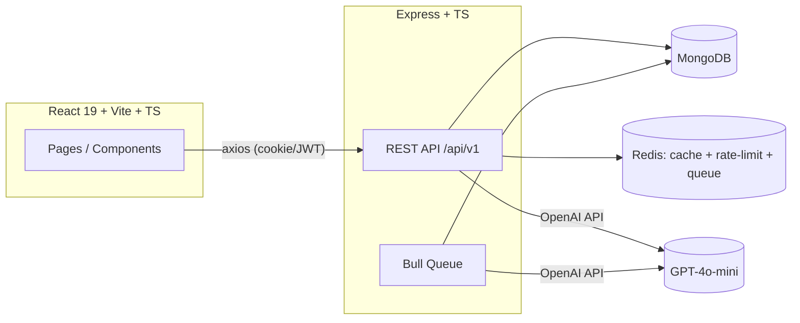

# HRM System — Project Plan

Last updated: 2026-08-17

This is the living plan for the AI-powered HRM System: what exists, what was
broken and got fixed, what's still open, and the roadmap to take this from
"working prototype" to production/enterprise grade.

Status legend: ✅ Done  🚧 In progress  📋 Planned  ⚠️ Needs a decision

---

## 1. Architecture snapshot

**Backend:** Express + TypeScript, MongoDB (Mongoose), Redis (cache, rate
limiting, Bull job queue), JWT auth via httpOnly cookie, OpenAI for resume
parsing / sentiment / attrition prediction, Winston logging.

**Frontend:** React 19 + Vite + TypeScript, axios for HTTP, intended
react-router-dom for routing and recharts for the dashboard charts.

Module layout is feature-based (`modules/auth`, `modules/employee`,
`modules/ai`) rather than layer-based — good, keep this pattern as the
system grows (e.g. a future `modules/payroll`, `modules/leave`).

---

## 2. Fixed this session

These were objective bugs (not design decisions) and have been corrected
directly in the codebase:

- [x] **Backend wouldn't compile at all** — `backend/tsconfig.json` was a
  0-byte file. Replaced with a strict, standard Node/TS config
  (`strict`, `forceConsistentCasingInFileNames`, `noUnusedLocals`, etc.).
- [x] **`auth.service.ts` import was broken** — `user.model.ts` lived at
  `src/modules/user.model.ts` but was imported as `./user.model` from
  `src/modules/auth/auth.service.ts` (expecting `src/modules/auth/user.model.ts`).
  Moved the file to the correct location.
- [x] **Filename-casing mismatch on rate-limit middleware** — the file was
  `ratelimit.middleware.ts` on disk but every route imported
  `rateLimit.middleware`. Windows' case-insensitive filesystem hid this;
  it would have failed hard on Linux (Docker/CI/prod). Renamed the file to
  match. `forceConsistentCasingInFileNames` (added above) now makes this
  class of bug a compile error instead of a runtime surprise.
- [x] **Frontend `package.json` was missing dependencies it already
  imports** — `axios`, `react-router-dom`, and `recharts` are used in the
  code (`api/axios.ts`, `Layout.tsx`, `Employees.tsx`, `Dashboard.tsx`) but
  were never declared, so `npm install` wouldn't have provided them. Added
  all three.
- [x] **Privilege escalation on public registration** — `POST /auth/register`
  accepted a client-supplied `role` field, so anyone could self-register as
  `admin`. Removed `role` from the public registration schema; new accounts
  always start as `employee` (Joi's `stripUnknown` drops any role a client
  sends). Granting elevated roles is now an admin-only action — see
  [§6 Phase 2](#phase-2--security-hardening).
- [x] **IDOR on `GET /api/v1/employees/:id`** — any authenticated user
  (including a plain `employee`) could fetch any other employee's full
  record, salary included. Added `EmployeeService.assertCanView()`:
  `admin`/`hr` see everyone, `manager` sees self + direct reports (by
  matching `Employee.manager`), `employee` sees only their own record.
- [x] **No `.gitignore` in `backend/`** — real risk of committing `.env`,
  `node_modules`, or log files. Added one.
- [x] **No `.env.example` for either app** — added `backend/.env.example`
  and `frontend/.env.example` documenting every required variable.

None of these needed a design call — they're bugs, not choices — so they
were fixed inline rather than left as plan items.

---

## 3. Backend — module status

| Module | Status | Notes |
|---|---|---|
| `config/db.ts`, `config/redis.ts`, `config/logger.ts` | ✅ Done | Sound: pooled Mongo connection, lazy Redis client with retry, rotating file logs in prod. |
| `middleware/auth.middleware.ts` | ✅ Done | Cookie-first, Bearer-header fallback. Fine as-is. |
| `middleware/validate.middleware.ts` | ✅ Done | Generic Joi middleware for body/query/params — good, reused everywhere. |
| `middleware/rateLimit.middleware.ts` | ✅ Done | Redis `INCR`+`EXPIRE` sliding window, fails open if Redis is down (correct tradeoff — don't let cache infra outages become an outage). |
| `middleware/error.middleware.ts` | ✅ Done | Centralized error shape, handles `AppError`, Mongoose dup-key/validation, JWT errors. |
| `modules/auth` | ✅ Done (fixed) | Register/login/logout/me/change-password. Role self-assignment hole closed this session. |
| `modules/employee` | ✅ Done (fixed) | CRUD + paginated list + cached stats + performance notes. IDOR closed this session. |
| `modules/ai` | ✅ Done | Resume parsing (PDF/TXT via OpenAI), sentiment analysis, attrition prediction — sentiment/attrition run async via Bull queue, which is the right call (don't block the request on an LLM call). |
| Seed script | 📋 Planned | `package.json` has a `seed` script pointing at `src/scripts/seed.ts`, which doesn't exist yet. Needed for local onboarding (create a first admin, sample departments/employees). |
| Backend ESLint config | 📋 Planned | `package.json` has a `lint` script but no `eslint.config.js`/`.eslintrc` exists yet. |
| Tests | 📋 Planned | No test files anywhere in the repo. See [Phase 3](#phase-3--testing). |
| OpenAPI/Swagger docs | 📋 Planned | No API documentation beyond reading the route files. |

## 4. Frontend — module status

| File | Status | Notes |
|---|---|---|
| `api/axios.ts` | ✅ Done | Configured instance, 401 → redirect interceptor. See open item on dual token storage below. |
| `context/AuthContext.tsx` | ✅ Done | Clean context + hook pattern. |
| `pages/Login.tsx` | ✅ Done | |
| `pages/Dashboard.tsx` | ✅ Done | Uses recharts (now a declared dependency). |
| `pages/Employees.tsx` | 🚧 Blocked | Imports `../hooks/useEmployees`, `../components/EmployeeFormModal`, `../components/FormField` — **none of these three exist yet.** Page cannot render until they're built. |
| `pages/AIInsights.tsx` | ✅ Done | Resume parser + sentiment analyzer UI, self-contained. |
| `components/Layout.tsx` | ✅ Done | Sidebar shell with nav + user menu, but nothing routes into it yet. |
| `components/EmployeeCard.tsx` | ⚠️ Empty, unused | 0 bytes. Not referenced anywhere. Decide: build it out (e.g. a card view for Employees) or delete it. |
| `components/ResumeParser.tsx` | ⚠️ Empty, unused | 0 bytes. `AIInsights.tsx` already has its own inline resume-parser UI, so this is redundant. Recommend deleting once confirmed. |
| `App.tsx` | 🚧 **Not wired up** | Still the default `create-vite` starter (counter button, Vite/React logos). None of the real pages, the router, or `AuthProvider` are mounted. **This is the single biggest gap in the project** — see Phase 1. |
| `main.tsx` | 🚧 Not wired up | Renders `<App />` directly; no `<AuthProvider>` / router wrapper. |

**Decision on record:** you asked to leave the frontend wiring (router +
`AuthProvider` + `Layout` + the missing `useEmployees` hook and
`EmployeeFormModal`/`FormField` components) as a documented follow-up rather
than build it in this pass. It's Phase 1 below — the very next thing to do,
just not done yet.

**Decision on record:** styling direction going forward is **Tailwind CSS +
Framer Motion** (replacing the current inline `style={{...}}` objects, which
work but duplicate the same colors/spacing across every page).

---

## 5. Known issues still open (not yet fixed — tracked here on purpose)

Severity-ordered:

1. **Dual token storage undermines the httpOnly cookie.** The backend sets
   the JWT as an httpOnly cookie *and* returns it in the JSON response body;
   the frontend then stores that copy in `localStorage` and manually attaches
   it as a `Bearer` header (`api/axios.ts`). Storing a JWT in `localStorage`
   makes it readable by any injected script, which defeats the whole point
   of `httpOnly`. **Recommendation:** pick one strategy — rely solely on the
   httpOnly cookie (drop the token from the JSON body and the
   `localStorage`/`Bearer` code in `axios.ts` and `AuthContext.tsx`). Belongs
   in Phase 1 since it touches the same files as the router wiring.
2. **No refresh-token rotation.** A single 7-day JWT is the only credential;
   there's no short-lived access token + refresh token pair, and no
   server-side revocation (e.g. on password change, the old cookie is
   cleared client-side but the JWT itself isn't blacklisted, so a copied
   token would still work until it expires). Fine for an MVP, not for
   production. Phase 2.
3. **No NoSQL-injection / param-pollution hardening.** Joi validation covers
   most input, but there's no `express-mongo-sanitize` or `hpp` middleware
   as defense in depth. Phase 2.
4. **`/health` doesn't check dependencies.** It always returns `200 ok`
   even if MongoDB or Redis is down. For real deployability (k8s liveness
   vs readiness probes) it should ping both. Phase 5.
5. **Graceful shutdown doesn't close Mongo/Redis.** `server.ts` closes the
   HTTP server on `SIGTERM`/`SIGINT` but never calls
   `mongoose.disconnect()` or `redisClient.quit()`. Minor, but sloppy for
   production rolling restarts. Phase 5.
6. **Enums duplicated across the codebase.** `role`, `department`, and
   `status` values are hand-typed in `types/index.ts`, `auth.schema.ts`,
   `employee.schema.ts`, `employee.model.ts`, and (once built) the frontend
   forms. A typo in one place silently diverges from the others. See DRY
   section below and Phase 1.
7. **Text search index defined but unused.** `EmployeeSchema.index({
   designation: "text" })` exists, but `employee.service.ts` searches with a
   `$regex` instead of `$text`, so the index never gets used for search (and
   an unanchored regex scan doesn't use any index efficiently at scale).
   Low priority until employee counts get large. Phase 6.
8. **Uploaded resumes are trusted by MIME type only**, which is
   client-supplied and spoofable. Low risk today (LLM just fails to parse
   garbage), but note it before this becomes a general file-upload feature.
9. **`EmployeeCard.tsx` / `ResumeParser.tsx` are empty, unreferenced files** —
   see §4, needs your call on build-vs-delete.

---

## 6. Enterprise roadmap

### Phase 0 — Stabilize ✅ *mostly done this session*
- [x] Backend compiles (`tsconfig.json`, file-path/casing fixes).
- [x] Frontend has its declared dependencies.
- [x] Registration privilege-escalation and employee-record IDOR closed.
- [x] `.gitignore` + `.env.example` for both apps.
- [ ] `npm install` in both `backend/` and `frontend/` to pull in the
      newly-declared packages, then a clean `npm run build` in each to
      confirm everything actually compiles end-to-end (couldn't be run in
      this sandbox — no `node_modules`/network available here).
- [ ] `backend/src/scripts/seed.ts` — create a first admin + sample data.

### Phase 1 — Wire up the frontend *(next up — you asked to defer this)*
- [ ] Add `react-router-dom` routes: `/login` (public), everything else
      behind an `AuthProvider`-aware `<ProtectedRoute>` wrapping `<Layout>`
      with child routes `/`, `/employees`, `/employees/:id`, `/ai-insights`.
- [ ] Mount `<AuthProvider>` in `main.tsx`, replace `App.tsx`'s Vite
      boilerplate with the router.
- [ ] Build `src/hooks/useEmployees.ts` (list + pagination + filters,
      mirroring `IPaginatedResponse` from the backend).
- [ ] Build `src/components/FormField.tsx` and
      `src/components/EmployeeFormModal.tsx` (create/edit employee).
- [ ] Resolve the dual-token-storage issue (see §5.1) while touching
      `AuthContext`/`axios.ts` anyway.
- [ ] Decide fate of `EmployeeCard.tsx` / `ResumeParser.tsx` (build or
      delete).
- [ ] Start the Tailwind + Framer Motion migration — install & configure
      Tailwind, convert `Layout.tsx` first (highest-traffic component), then
      migrate page-by-page rather than a big-bang rewrite.
- [ ] Centralize shared constants (roles/departments/statuses) into
      `frontend/src/constants/` mirroring the backend's enum values, to stop
      the duplication called out in §5.6.

### Phase 2 — Security hardening
- [ ] Access-token/refresh-token split with server-side revocation list
      (Redis) for logout/password-change.
- [ ] `express-mongo-sanitize` + `hpp` middleware.
- [ ] Admin-only "create user with role" / "change user role" endpoint,
      now that public self-registration can't grant privileges.
- [ ] Audit log for sensitive actions (role changes, salary changes,
      terminations) — who did what, when.
- [ ] Secrets management guidance in README (never commit `.env`; use a
      secrets manager in real deployments).

### Phase 3 — Testing
- [ ] Standardize on **Vitest** for both apps (one test runner across the
      monorepo instead of Jest + something else — less tooling to maintain).
- [ ] Backend: Vitest + Supertest for route/integration tests, `mongodb-memory-server`
      for isolated DB tests.
- [ ] Frontend: Vitest + React Testing Library for component tests.
- [ ] CI gate: tests + lint + build must pass before merge (ties into
      Phase 4).

### Phase 4 — DevOps / CI-CD
- [ ] `Dockerfile` for backend, `Dockerfile` for frontend (multi-stage,
      nginx or a small static server for the built assets).
- [ ] `docker-compose.yml` for local dev (Mongo + Redis + backend +
      frontend) so a new contributor runs one command instead of installing
      Mongo/Redis locally.
- [ ] GitHub Actions: lint → build → test on every PR.
- [ ] Environment-specific config validation on boot (fail fast if a
      required env var is missing, instead of failing at first use).

### Phase 5 — Observability & production readiness
- [ ] `/health/live` and `/health/ready` (ready pings Mongo + Redis).
- [ ] Close Mongo/Redis connections in graceful shutdown.
- [ ] Request-ID / correlation-ID middleware threaded through logs.
- [ ] OpenAPI spec (`swagger-jsdoc` + `swagger-ui-express`) generated from
      the Joi schemas or hand-maintained alongside them.
- [ ] Error tracking (Sentry or similar) for both apps.

### Phase 6 — Feature expansion (post-stabilization)
- [ ] Switch employee search to the existing `$text` index instead of
      `$regex`.
- [ ] Employee self-service "my profile" view distinct from the admin list.
- [ ] Leave/attendance tracking module (same feature-module pattern as
      `employee`/`ai`).
- [ ] Payroll module.
- [ ] Notifications (email/in-app) for AI-flagged high attrition risk.

---

## 7. Principles audit (KISS / DRY / SOLID / Clean Code)

What's already good, kept as-is:
- **KISS:** the Redis rate limiter is a plain `INCR`/`EXPIRE` pair instead
  of pulling in a rate-limit library — exactly the right amount of code for
  what it does.
- **SOLID (SRP):** feature-module split (`controller` → `service` → `model`)
  is consistently applied and keeps each file doing one job.
- **Clean Code:** consistent `AppError`/`next(err)` pattern means every
  route handler looks the same and errors funnel through one place.

What to improve, tracked above:
- **DRY:** role/department/status enums duplicated in ~4 backend files
  (Phase 1 item) and will duplicate into the frontend forms too if not
  centralized first.
- **DRY:** every frontend page redefines its own `styles` object with the
  same purple gradient, card shadow, border-radius values — this is exactly
  what the Tailwind migration (Phase 1) is meant to fix; a shared design
  token set (Tailwind theme config) replaces ~7 copies of the same colors.
- **SRP nuance:** `EmployeeService.assertCanView()` (added this session)
  mixes authorization logic into the service layer rather than middleware,
  because the rule depends on data only the service has loaded (whose
  manager an employee has). This is a deliberate, documented exception, not
  a violation — flagging it so it doesn't get "fixed" into a middleware that
  would need a duplicate DB query to do the same check.

---

## 8. Decisions already made (for reference)

| Decision | Answer |
|---|---|
| Fix build-blocking bugs immediately? | Yes — done this session. |
| Build out frontend router/hooks/modal now or later? | Later — documented as Phase 1. |
| Access rule for `GET /employees/:id`? | Self + admin/hr + manager-of-report. Implemented this session. |
| Frontend styling direction? | Tailwind CSS + Framer Motion. |

No open questions blocking Phase 0 completion. Phase 1 kickoff will likely
raise a few more (e.g. exact route tree, whether "my profile" is a separate
page or a filtered view of Employees) — those will be added here as they
come up.
