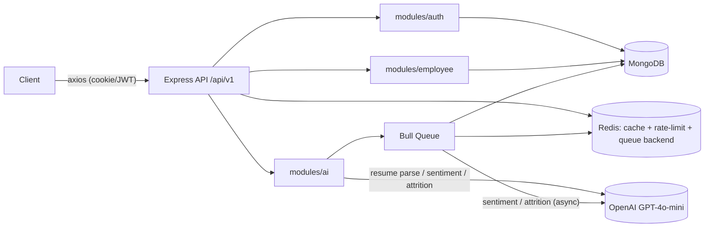

# HRM System — Backend Plan

Last updated: 2026-08-17
Scope: `backend/` only. Derived from the root [`PROJECT_PLAN.md`](../PROJECT_PLAN.md) — this
document expands §3, §5 (backend items), and the backend-relevant parts of §6
into concrete, sequenced, file-level work.

Status legend: ✅ Done  🚧 In progress  📋 Planned  ⚠️ Needs a decision

---

## 1. Current architecture



Stack: Express 4 + TypeScript 5 (strict), Mongoose 8 (MongoDB), ioredis 5
(cache, sliding-window rate limit, Bull queue backend), JWT auth via httpOnly
cookie with Bearer fallback, Joi validation, Winston + daily-rotate file logs,
Helmet + CORS, Multer for resume uploads, OpenAI SDK for AI features.

Module layout is feature-based:

```
src/
  config/      db.ts, redis.ts, logger.ts
  middleware/  auth, validate, rateLimit, error
  modules/
    auth/      controller, routes, schema, service, user.model
    employee/  controller, routes, schema, service, model
    ai/        controller, routes, service, queue
  types/       index.ts
  app.ts       server.ts
```

Keep this pattern as new modules are added (`modules/leave`,
`modules/payroll`, etc. — see Phase 6).

---

## 2. Module status (current)

| Module | Status | Notes |
|---|---|---|
| `config/db.ts` | ✅ Done | Pooled Mongo connection. |
| `config/redis.ts` | ✅ Done | Lazy client with retry. |
| `config/logger.ts` | ✅ Done | Rotating file logs in prod. |
| `middleware/auth.middleware.ts` | ✅ Done | Cookie-first, Bearer-header fallback. |
| `middleware/validate.middleware.ts` | ✅ Done | Generic Joi middleware for body/query/params, reused everywhere. |
| `middleware/rateLimit.middleware.ts` | ✅ Done | Redis `INCR`+`EXPIRE` sliding window; fails open if Redis is down (correct tradeoff). |
| `middleware/error.middleware.ts` | ✅ Done | Centralized error shape: `AppError`, Mongoose dup-key/validation, JWT errors. |
| `modules/auth` | ✅ Done | Register/login/logout/me/change-password. Role self-assignment hole closed. |
| `modules/employee` | ✅ Done | CRUD + paginated list + cached stats + performance notes. IDOR closed (`assertCanView`). |
| `modules/ai` | ✅ Done | Resume parsing (PDF/TXT via OpenAI), sentiment analysis, attrition prediction. Sentiment/attrition run async via Bull — correct, doesn't block the request on an LLM call. |
| `src/scripts/seed.ts` | 📋 Planned | Referenced by `package.json`'s `seed` script but doesn't exist. |
| ESLint config | 📋 Planned | `lint` script exists, no `eslint.config.js`/`.eslintrc`. |
| Tests | 📋 Planned | No test files anywhere. |
| OpenAPI/Swagger docs | 📋 Planned | None beyond reading route files. |

---

## 3. Known backend issues (open, ordered by severity)

1. **Dual token storage undermines the httpOnly cookie.** `auth.controller.ts`
   sets the JWT as an httpOnly cookie *and* returns it in the JSON response
   body, which the frontend then stores in `localStorage`. Fix on the backend
   side: stop returning the token in the response body for
   `login`/`register`/`refresh`-style endpoints once the frontend is updated
   to rely solely on the cookie (coordinate with frontend Phase 1 — don't ship
   the backend half without the frontend half or login breaks).
2. **No refresh-token rotation / revocation.** A single 7-day JWT is the only
   credential. No short-lived access token + refresh token pair, no
   server-side revocation list, so a copied token stays valid until natural
   expiry even after logout or password change.
3. **No NoSQL-injection / param-pollution hardening.** Joi covers most input
   but there's no `express-mongo-sanitize` or `hpp` middleware as defense in
   depth.
4. **`/health` doesn't check dependencies.** Always `200 ok` even if MongoDB
   or Redis is down — breaks k8s liveness/readiness semantics.
5. **Graceful shutdown doesn't close Mongo/Redis.** `server.ts` closes the
   HTTP server on `SIGTERM`/`SIGINT` but never calls `mongoose.disconnect()`
   or `redisClient.quit()`.
6. **Enums duplicated across the codebase.** `role`, `department`, `status`
   are hand-typed in `types/index.ts`, `auth.schema.ts`, `employee.schema.ts`,
   and `employee.model.ts`. A typo in one place silently diverges from the
   others.
7. **Text search index defined but unused.** `EmployeeSchema.index({
   designation: "text" })` exists, but `employee.service.ts` searches with
   `$regex`, so the index is dead weight and search doesn't scale.
8. **Uploaded resumes are trusted by MIME type only** — client-supplied,
   spoofable. Low risk today (bad input just fails to parse), but a real gap
   if file upload becomes a general feature.

---

## 4. Backend roadmap

### Phase 0 — Stabilize (mostly done)
- [x] Backend compiles (`tsconfig.json` fixed from 0 bytes; import path and
      filename-casing fixes).
- [x] Registration privilege-escalation closed (`role` stripped from public
      register schema).
- [x] Employee-record IDOR closed (`EmployeeService.assertCanView()`).
- [x] `.gitignore` + `backend/.env.example`.
- [ ] `npm install` then `npm run build` — confirm a clean compile end-to-end
      (not run yet in this environment — no network/node_modules here).
- [ ] `src/scripts/seed.ts` — create a first admin user + sample departments
      and employees so a fresh clone is usable without manual DB entry.
      - Reads `MONGO_URI` from env, connects, upserts one admin
        (`ADMIN_EMAIL`/`ADMIN_PASSWORD` from env, hashed via the existing
        `User` model pre-save hook), then inserts a handful of sample
        employees across departments if the collection is empty.
      - Idempotent: safe to re-run (upsert by email, `insertMany` guarded by
        a count check).

### Phase 1 — Backend items that unblock/pair with frontend Phase 1
These are the backend-owned pieces of work the deferred frontend wiring
depends on, plus the enum duplication cleanup:
- [ ] Centralize `role` / `department` / `status` enums in one place
      (e.g. `src/constants/enums.ts`) and import into `types/index.ts`,
      `auth.schema.ts`, `employee.schema.ts`, `employee.model.ts` instead of
      re-typing the literal lists. Export the same shape so the frontend can
      mirror it in `frontend/src/constants/`.
- [ ] Resolve dual-token-storage (§3.1): once frontend switches to
      cookie-only auth, drop the token field from
      `login`/`register` JSON responses in `auth.controller.ts`.
- [ ] Confirm CORS config (`app.ts`) allows credentials from the frontend's
      dev origin so cookie-only auth actually works cross-port in dev.

### Phase 2 — Security hardening
- [ ] Access-token/refresh-token split:
      - Short-lived access JWT (e.g. 15 min) + longer-lived refresh token,
        refresh token stored httpOnly + a server-side allowlist/denylist in
        Redis (`refresh:<userId>:<tokenId>`) so it can be revoked.
      - `POST /auth/refresh` endpoint to rotate the access token.
      - Revoke on logout and on password change (`auth.service.ts`
        `changePassword` already exists — add revocation there).
- [ ] `express-mongo-sanitize` + `hpp` middleware, wired in `app.ts` alongside
      the existing `helmet()`/`cors()` calls.
- [ ] Admin-only endpoint(s): `PATCH /admin/users/:id/role` (or similar) to
      grant elevated roles, now that public self-registration can't. Gate
      with the existing `auth.middleware` role check pattern used elsewhere.
- [ ] Audit log for sensitive actions (role changes, salary changes,
      terminations): a lightweight `AuditLog` model (`actorId`, `action`,
      `targetId`, `diff`, `timestamp`) written from the relevant service
      methods, not the controller, to keep it consistent regardless of entry
      point.
- [ ] README section on secrets management (never commit `.env`; use a
      secrets manager in real deployments) — cross-reference
      `backend/.env.example`.

### Phase 3 — Testing
- [ ] Adopt **Vitest** (shared choice with frontend — one test runner across
      the monorepo).
- [ ] Vitest + Supertest for route/integration tests, one suite per module
      (`auth`, `employee`, `ai`) mirroring the existing folder layout, e.g.
      `src/modules/employee/employee.service.test.ts`.
- [ ] `mongodb-memory-server` for isolated DB tests — no shared dev DB state
      leaking between test runs.
- [ ] Priority test coverage, in order:
      1. `EmployeeService.assertCanView()` — the IDOR fix is exactly the kind
         of logic that regresses silently without a test.
      2. Auth: register (role can't be self-assigned), login, password
         change.
      3. Rate-limit middleware (Redis down → fails open, as designed).
      4. Employee CRUD + pagination.
      5. AI controller: mock the OpenAI client, assert queue jobs are
         enqueued correctly for sentiment/attrition rather than run inline.
- [ ] CI gate: lint + build + test must pass before merge (ties into Phase 4).

### Phase 4 — DevOps / CI-CD
- [ ] `backend/Dockerfile` — multi-stage (build with full deps, run with
      `--omit=dev`), `node dist/server.js` as entrypoint.
- [ ] Add backend service to a root `docker-compose.yml` alongside Mongo,
      Redis, and frontend, so a new contributor runs one command instead of
      installing Mongo/Redis locally.
- [ ] GitHub Actions workflow: `npm ci` → `npm run lint` → `npm run build` →
      `npm test`, on every PR touching `backend/**`.
- [ ] Boot-time env validation (Joi schema over `process.env`, fail fast
      before `server.ts` starts listening) instead of failing on first use of
      a missing var deep in a request handler.

### Phase 5 — Observability & production readiness
- [ ] Split `/health` into `/health/live` (process is up) and `/health/ready`
      (pings MongoDB via `mongoose.connection.readyState` and Redis via
      `PING`), matching k8s liveness/readiness probe semantics.
- [ ] Close Mongo/Redis connections in the `SIGTERM`/`SIGINT` handler in
      `server.ts`: `await mongoose.disconnect()`, `await redisClient.quit()`,
      before process exit.
- [ ] Request-ID / correlation-ID middleware (generate or propagate
      `X-Request-Id`, attach to Winston's per-request child logger) so a
      single request's logs can be traced end-to-end.
- [ ] OpenAPI spec via `swagger-jsdoc` + `swagger-ui-express`, generated from
      (or hand-maintained next to) the existing Joi schemas in each module.
- [ ] Error tracking (Sentry or similar) wired into `error.middleware.ts`.

### Phase 6 — Feature expansion (post-stabilization)
- [ ] Switch `employee.service.ts` search from `$regex` to the existing
      `$text` index (`EmployeeSchema.index({ designation: "text" })`) —
      unlocks real index usage at scale.
- [ ] Employee self-service "my profile" endpoint distinct from the
      admin/manager list view (or confirm `assertCanView` already covers this
      via `GET /employees/:id` with `id = self`).
- [ ] `modules/leave` — leave/attendance tracking, same
      controller/service/model/routes/schema pattern as `employee`.
- [ ] `modules/payroll` — same pattern.
- [ ] Notifications (email/in-app) triggered from the AI attrition-prediction
      queue job when risk crosses a threshold.

---

## 5. Principles audit (backend-specific)

Good, keep as-is:
- **KISS:** Redis rate limiter is a plain `INCR`/`EXPIRE` pair, not a pulled-in
  library — right-sized for what it does.
- **SOLID (SRP):** `controller → service → model` split is consistent across
  all three modules.
- **Clean Code:** every route funnels errors through `AppError`/`next(err)`
  and the single `error.middleware.ts` — uniform error shape.

To improve (tracked above):
- **DRY:** role/department/status enums duplicated in ~4 files (Phase 1).
- **SRP nuance, documented exception, not a bug:**
  `EmployeeService.assertCanView()` puts authorization logic in the service
  layer instead of middleware, because the rule depends on data only the
  service has loaded (an employee's `manager` field). Don't "fix" this into
  middleware — that would require a duplicate DB query to re-derive the same
  check.

---

## 6. Decisions already made (backend-relevant, for reference)

| Decision | Answer |
|---|---|
| Fix build-blocking bugs immediately? | Yes — done. |
| Access rule for `GET /employees/:id`? | Self + admin/hr + manager-of-report, enforced in `EmployeeService.assertCanView()`. |
| Test runner | Vitest (shared with frontend, Phase 3). |
| Dual token storage | To be resolved together with frontend router/auth wiring — not a backend-only change (see §3.1, Phase 1). |

No open questions blocking Phase 0 completion on the backend. Flag decisions
as they come up in Phase 1/2 (e.g. exact refresh-token TTLs, whether audit
logs need their own retention policy).
