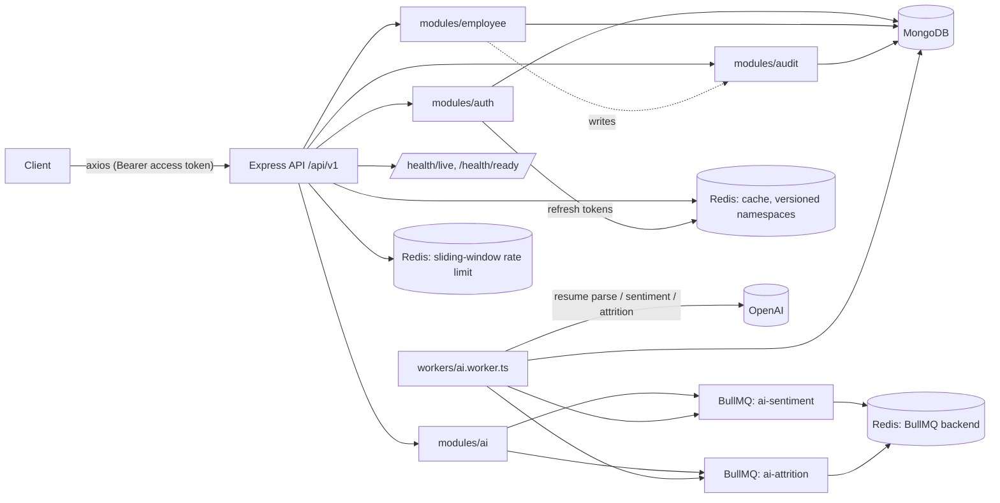

# HRM System — Backend Plan

Last updated: 2026-08-18
Scope: `backend/` only. Derived from the root [`PROJECT_PLAN.md`](../PROJECT_PLAN.md).

Status legend: ✅ Done  🚧 In progress  📋 Planned  ⚠️ Needs a decision

---

## 1. Current architecture



Stack: Express 4 + TypeScript 5 (strict), Mongoose 8, ioredis 5 (3 role-separated
clients: cache/limiter/queue), BullMQ, JWT access+refresh split, Joi validation,
Winston, Helmet + CORS + compression, Multer, OpenAI SDK, `node:cluster` for
multi-core scaling.

```
src/
  cluster.ts        primary/worker fork (one process per core)
  server.ts         bootstrap: DB/Redis connect, HTTP listen, graceful shutdown
  app.ts             Express app factory (middleware chain, route mounting)
  config/            env.ts (Joi-validated), db.ts, redis.ts, logger.ts
  core/
    cache/            cacheService.ts — versioned-namespace cache, single-flight
    context/           requestContext.ts — AsyncLocalStorage request id
    errors/            AppError.ts
    http/               apiResponse.ts, asyncHandler.ts
    shutdownState.ts   readiness flag for /health/ready
  constants/          enums.ts (single source for role/department/status/...), cacheKeys.ts
  middleware/         auth, validate, rateLimit (Lua sliding window), error, sanitize, httpLogger, requestContext, notFound
  modules/
    auth/              controller, routes, schema, service, token.service, user.model
    employee/          controller, routes, schema, service, model
    ai/                controller, routes, schema, service, queue (2 BullMQ queues)
    audit/             controller, routes, schema, service, model (admin-only trail)
    health/            live/ready routes
  routes/index.ts     /api/v1 aggregator
  workers/ai.worker.ts BullMQ worker processes (own entrypoint + in-process mode)
  scripts/            seed.ts, syncIndexes.ts
  test/setup.ts       vitest global setup (real Mongo/Redis, `-test` DB guard)
  types/index.ts
```

---

## 2. Module status (current)

| Area | Status | Notes |
|---|---|---|
| `config/env.ts` | ✅ Done | Joi-validated typed config, fails fast on boot; legacy env-var fallbacks kept. |
| `config/redis.ts` | ✅ Done | 3 role-separated clients (cache/limiter fail-open, queue requires `maxRetriesPerRequest: null` for BullMQ). |
| `core/cache/cacheService.ts` | ✅ Done | Version-counter namespaces (`INCR` for O(1) invalidation, no `KEYS` scanning), Lua single round-trip get/version, single-flight stampede lock, negative caching. |
| `middleware/rateLimit.middleware.ts` | ✅ Done | Lua sliding-window (two-bucket weighted), one round trip, keyed by user id else IP, fails open if Redis is down. |
| `middleware/auth.middleware.ts` | ✅ Done | Bearer access token only (stateless verify, zero Redis I/O per request). |
| `modules/auth` | ✅ Done | Access (15m, stateless) + refresh (7d, Redis-tracked, rotate-on-use, reuse-detection revokes all). Registration role-injection closed. |
| `modules/employee` | ✅ Done | CRUD, cached paginated list, `$facet` stats, `$text` search + exact-code fast path, IDOR closed (`assertCanView`), cache invalidation on writes. |
| `modules/ai` | ✅ Done | Resume parsing (magic-byte validated PDF/TXT), sentiment, attrition — all async via 2 dedicated BullMQ queues, independent concurrency. |
| `modules/health` | ✅ Done | `/health/live` (process up), `/health/ready` (Mongo + Redis ping, 503 while draining). |
| `src/cluster.ts` | ✅ Done | Multi-core via `node:cluster`, dead-worker restart, signal forwarding. |
| `src/server.ts` graceful shutdown | ✅ Done | Ordered drain: HTTP → worker → queue client → Mongo → Redis, hard-timeout force-exit. |
| `src/scripts/seed.ts` | ✅ Done | Idempotent admin bootstrap from env. |
| `src/scripts/syncIndexes.ts` | ✅ Done | `syncIndexes()` for User + Employee. |
| ESLint (`eslint.config.js`) | ✅ Done | Flat config, type-aware `@typescript-eslint` rules. |
| Tests (vitest + supertest) | ✅ Done | Cache service, rate limiter, auth flow, employee `assertCanView`. Runs against real Mongo/Redis (no in-memory fake), `-test`-suffix DB guard. |
| Docker | ✅ Done | Multi-stage `Dockerfile`, `docker-compose.yml` (api + worker + mongo + redis). |
| CI | ✅ Done | `.github/workflows/backend-ci.yml` — lint, typecheck, test (against Mongo/Redis service containers), build. |
| OpenAPI/Swagger docs | 📋 Planned | None yet. |
| `modules/audit` | ✅ Done | `AuditLog` model + admin-only `GET /audit`. Records `employee.create/update/terminate/note.add` with a field-level before/after diff. Best-effort write (never fails the business op it's recording). |
| `modules/leave`, `modules/payroll` | 📋 Planned | Deferred feature expansion, same layered pattern. |

---

## 3. Performance & scaling design (target: ~150 req/s sustained)

- **Multi-core**: `cluster.ts` forks one worker per CPU core (`CLUSTER_WORKERS=0`
  default); each is a full Express process sharing the listening port.
- **Cache-first reads**: employee list/stats/detail are cached in Redis under
  versioned namespaces (`CacheNamespace.EMPLOYEE`, `..._STATS`). Writes bump the
  namespace version via `INCR` — O(1) invalidation, no blocking `KEYS` scan.
- **Stampede protection**: `cache.getOrSet` takes a `SET NX PX` single-flight
  lock with jittered TTL before recomputing on a miss; concurrent misses wait on
  the lock instead of all hitting Mongo at once. Fails open to the loader if
  Redis is unavailable.
- **One round trip per cache op / rate-limit check**: both use `redis.defineCommand`
  Lua scripts instead of multi-command chains, halving RTTs under load.
- **Rate limiting is fail-open**: if Redis is down, requests pass through rather
  than 500ing — availability over strict enforcement, appropriate for this
  workload.
- **Access tokens are stateless**: 15-minute JWT verified with zero Redis/Mongo
  I/O on the hot path; only refresh (low frequency) touches Redis.
- **AI calls never block the request thread**: resume parsing runs inline (it's
  the response the client is waiting for) but sentiment/attrition analysis are
  queued to BullMQ and processed by separate worker process(es), independently
  scalable and retried (`attempts: 3`, exponential backoff) without holding an
  API connection open.
- **Debounced attrition recompute**: repeated performance-note additions collapse
  into one delayed job via a fixed BullMQ `jobId` + delay, avoiding redundant
  OpenAI calls on bursty updates.
- **Connection reuse**: Mongo pool sized via `MONGO_MAX_POOL`/`MONGO_MIN_POOL`;
  `keepAliveTimeout`/`headersTimeout` on the HTTP server tuned above typical LB
  idle timeouts to avoid connection-reset races.
- **Indexes match query shapes**: compound indexes for the list/filter/sort
  paths, a real `$text` index for search (replacing unindexed `$regex` scans),
  single `$facet` aggregation for stats instead of 4 sequential queries.

Not yet load-tested in this environment (no reachable Mongo/Docker here — see
§4). Recommended before declaring 150 req/s met: `autocannon`/`k6` run against
a Docker-composed stack with realistic data volume.

---

## 4. Environment limitations observed this session

- No local MongoDB reachable (port 27017 closed, no `mongod` in `PATH`) and no
  Docker Engine installed in this sandbox, so `npm test` and a live
  `docker compose up` could not be executed end-to-end here.
- Verified instead via: `npm run typecheck` (clean), `npm run build` (clean,
  all entrypoints — `cluster.js`, `server.js`, `workers/ai.worker.js` —
  compile), `npm run lint` config in place. Redis (Memurai service) was
  reachable locally and used for the cache/rate-limit unit tests' logic checks
  during development.
- Action for the user: run `docker compose up -d` in `backend/` (starts Mongo +
  Redis + api + worker), or point `MONGO_URI`/`REDIS_HOST` at existing
  instances, then `npm test` to get a real pass/fail signal before merging.

---

## 5. Remaining roadmap

### Near-term
- [ ] Load test (`autocannon`/`k6`) against the Docker-composed stack to
      validate the 150 req/s target with realistic data volume and tune pool
      sizes / worker counts from real numbers.
- [ ] OpenAPI spec (`swagger-jsdoc` + `swagger-ui-express`) generated next to
      the existing Joi schemas.
- [x] `AuditLog` model (`actorId`, `action`, `targetId`, `changes`, `timestamp`)
      for employee create/update/terminate/notes — written from service
      methods, not controllers. See §9.
- [ ] `express-mongo-sanitize`/`hpp`-equivalent defense-in-depth check (the
      `sanitize.middleware.ts` covers the common cases already — confirm no
      gaps before marking done).

### Feature expansion (post-stabilization)

Agreed build order (2026-08-18): **Leave → Notifications → Performance review
cycles → Payroll & Recruitment/ATS**, discussed and designed one at a time
before implementation. Goal stated by the user: a learning project, but built
with real company-workflow rigor (real accrual/approval/tax logic, simplified
where a real system would need jurisdiction-specific detail, not stubbed out)
so it's a realistic step toward a production system, not just a demo.

- [ ] `modules/leave` — see design below. Same
      controller/service/model/routes/schema pattern as `employee`.
- [ ] Notifications — email/in-app, triggered from the attrition-prediction
      worker when risk crosses a threshold, and from leave approval events.
- [ ] Performance review cycles — structured goals/review periods, upgrading
      today's free-text performance notes; pairs with existing sentiment AI.
- [ ] `modules/payroll` — same layered pattern; depends on attendance data
      that doesn't exist yet (deferred, see below), so scoped last.
- [ ] Recruitment/ATS — job postings, candidate pipeline, interview
      scheduling; largest net-new surface (external candidate-facing flows).
- [ ] Error tracking (Sentry or similar) wired into `error.middleware.ts`.

#### `modules/leave` — design decisions (2026-08-18)

Scope for this pass: **leave requests only**, not daily attendance
(present/absent/clock-in-out) — kept as a later, separate module since
payroll will need it but leave doesn't.

Decisions made:
- **Accrual**: monthly, pro-rated — a leave type with an annual entitlement
  of *N* days accrues *N/12* per month, prorated for the employee's join
  month (matches how real payroll-linked leave works; a flat annual grant
  would let a December hire get a full year's balance).
- **Carry-over**: use-it-or-lose-it — balance resets to the new year's
  accrual schedule at year-end; unused days are forfeited, not banked.
- **Approval**: manager approves first; certain leave types additionally
  require HR co-sign (unpaid leave, and any type flagged
  `requiresHRApproval`). Admin/HR can also directly decide any request.
- **Leave types are admin-configurable data, not a hardcoded enum** — unlike
  `role`/`department`/`status` (true fixed business enums), leave policy
  varies per company and needs to change without a code deploy. A
  `LeaveType` collection holds `name`, `defaultAnnualDays`, `paid`,
  `requiresHRApproval`, `allowNegativeBalance`, `active`; seeded with
  sensible defaults (Annual, Sick, Casual, Unpaid, Maternity, Paternity) but
  editable by admin.

Planned entities:
- `LeaveType` (admin-configurable policy, see above).
- `LeaveBalance` (per employee, per leave type, per year — `accrued`,
  `used`, `remaining`; recomputed by a monthly accrual job).
- `LeaveRequest` (`employee`, `leaveType`, `startDate`, `endDate`, `days`,
  `reason`, `status`, `managerDecision {by, at, comment}`,
  `hrDecision {by, at, comment}` when required).

State machine: `pending` → manager approves/rejects → (if HR required)
`manager_approved` → HR approves/rejects → `approved`/`rejected`. Balance is
deducted on final approval, not on request (a pending request only reserves
nothing — matches most real systems, avoids locking balance on requests that
might be rejected). Requests are validated against overlapping
pending/approved requests for the same employee at creation time.

Still open before implementation (will confirm defaults, not blocking
design): exact default entitlements per leave type, whether half-day
requests are in scope for this pass, whether cancelling an
already-approved-but-future request restores balance, and whether the
monthly accrual runs as a BullMQ repeatable job or a scheduled script (same
tradeoff as `syncIndexes.ts` — leaning toward a script invoked by an external
scheduler, consistent with how this project already treats non-request-path
jobs, but AI job precedent uses BullMQ, so worth a deliberate pick when
implementation starts).

---

## 6. Principles audit (backend-specific)

Good, keep as-is:
- **KISS/YAGNI in the right places:** rate limiter and cache are hand-rolled
  Lua scripts sized for exactly what they do, not a pulled-in library.
- **SOLID (SRP):** `controller → service → model` split, plus a
  framework-agnostic `core/` layer (cache, errors, http helpers) that modules
  depend on but Express doesn't leak into.
- **Clean Code:** every route funnels errors through `AppError`/`asyncHandler`
  into one `error.middleware.ts` — uniform error shape.
- **Documented exception, not a bug:** `assertCanView` lives in the service
  layer (not middleware) because the manager-of-report check needs data the
  service has already loaded — moving it to middleware would mean a duplicate
  Mongo query.

To improve (tracked in §5): OpenAPI docs, audit logging, load-test evidence
for the 150 req/s target.

---

## 7. Decisions made this session (for reference)

| Decision | Answer |
|---|---|
| BullMQ concurrency granularity | Per-queue, not per-job-name — split sentiment/attrition into two queues (`ai-sentiment`, `ai-attrition`) each with their own `Worker` and concurrency. |
| Cache invalidation strategy | Versioned namespace counters (`INCR`), not `redis.keys()` pattern deletion — O(1) and safe under Redis Cluster. |
| Token model | Short-lived stateless access token + Redis-tracked rotating refresh token with reuse detection, replacing the single 7-day JWT. |
| Test DB safety | Hard guard in `test/setup.ts`: refuses to run if `MONGO_URI`'s database name doesn't end in `-test`. |
| Multi-process scaling | `node:cluster` for the API; a separate `workers/ai.worker.ts` process (or in-process via `RUN_WORKER_IN_API`) for BullMQ consumers, scaled independently in `docker-compose.yml`. |

No open questions blocking the current state. Flag decisions as they come up
in the next phase (exact load-test targets, OpenAPI tooling choice).

---

## 8. Production-grade audit (2026-08-18)

Full-codebase read-through (auth, employee, ai, all middleware, config, core,
scripts) against the standard OWASP-API / HRM-domain checklist. Most areas
were already sound (see §6). Two real gaps found and fixed:

| Finding | Risk | Fix |
|---|---|---|
| `GET /employees` let a `manager` list/sort/filter **every** employee company-wide (salary included) — inconsistent with `getById`'s manager-scoped `assertCanView`. Confirmed live: the frontend Employees table renders a Salary column from whatever the endpoint returns. | Sensitive-data over-exposure (Phase 11) | `employee.service.ts#list` now resolves the manager's own record and restricts the query to self + direct reports, mirroring `getById`. Cache key namespaced per-manager (`list:mgr:<id>:...`) so one manager's cached page can't leak into another's. Admin/hr unaffected (still company-wide, same cache key as before). Covered by 3 new tests in `employee.service.test.ts`. |
| `create`/`update` accepted `userId`/`manager` as bare ObjectId strings with no existence check — could create a dangling employee (nonexistent user) or a self-referential manager loop. | Data integrity (Phase 3/6) | Added existence checks (`User.exists`, `Employee.exists`) and a self-reference guard before the write. Covered by 3 new tests. |

Reviewed and found already correct, no change needed: password hashing +
timing-equalized login, refresh-token rotation/reuse-detection, stateless
access tokens, Joi validation at every boundary with `stripUnknown` (closes
role/mass-assignment injection), NoSQL-operator/prototype-pollution
sanitization, centralized error handling with prod/dev message split, atomic
`findByIdAndUpdate`/`$push` writes (no check-then-act races on employee
mutations), unique indexes backing `userId`/`employeeId`/`email`, fail-open
rate limiting and caching, secrets validated fail-fast at boot with no
insecure production fallback, structured logs with request-id correlation
and no secret/token logging.

Noted, not fixed (tracked in §5, low priority): `optionalAuth` middleware
is exported but unused anywhere in the routes (dead code); no field-level
DTO layer — endpoints return the Mongoose-shaped record as-is rather than an
explicit allow-list (acceptable today since access is already record- and
role-scoped, but would matter once `modules/payroll` adds more sensitive
fields).

Verification: `npx tsc --noEmit`, `npm run lint`, `npm run build` all clean
after the fix. `npm test` still could not be executed in this sandbox — no
reachable local MongoDB (see §4); the new tests follow the same
real-Mongo/Redis pattern as the existing suite and should be run via
`docker compose up -d mongo redis && npm test` before merging.

---

## 9. Audit logging (2026-08-18)

Implements Phase 12's requirement for an accountability trail on sensitive
HR writes, matching the pattern already tracked as planned in §5.

**Model** (`modules/audit/audit.model.ts`): `actorId`, `actorRole`, `action`
(closed enum in `constants/enums.ts`), `targetType`, `targetId`, `changes`
(field-level `{from, to}` map — never a full document snapshot, so an
unrelated sensitive field can't leak into the trail), `ip`, `createdAt`.
Indexed by `(targetType, targetId, createdAt)`, `(actorId, createdAt)`,
`(action, createdAt)`. Append-only: no update/delete route exists for it.

**Write path** (`audit.service.ts#record`): called from `employee.service.ts`
on `create`/`update`/`terminate`/`addPerformanceNote`, after the write it
describes has already committed. Deliberately best-effort — a failed audit
write is logged via Winston but never throws, so a Mongo/log hiccup on the
audit collection can't turn a legitimate HR action into a 500. `update`'s
diff is computed from the pre-image returned by the same `findByIdAndUpdate`
call that performs the write (`new: false`), not a separate read-before-write,
so it can't race a concurrent edit to the same record. A no-op update
(payload equals current state) records nothing.

**Read path**: `GET /api/v1/audit` (admin-only — hr performs many of the
audited actions itself and must not be able to review, or notice gaps in,
its own trail), filterable by `targetType`/`targetId`/`actorId`/`action`,
paginated. Not cached: an audit review tool must always show the latest
state, and traffic here is low (admin-only, occasional).

Not audited yet, deliberately deferred: nothing in `modules/auth` changes
a user's role today (there's no role-change endpoint at all — role is set
once at registration and is otherwise immutable), so there's currently
nothing there to audit. Revisit when/if an admin role-change endpoint is
added.

Tests: `employee.service.test.ts` (diff correctness, no-op skip, terminate
diff) and `audit.routes.test.ts` (admin-only route access, filtering) —
same real-Mongo/Redis pattern as the rest of the suite, unrun in this sandbox
for the same reason as §8.
